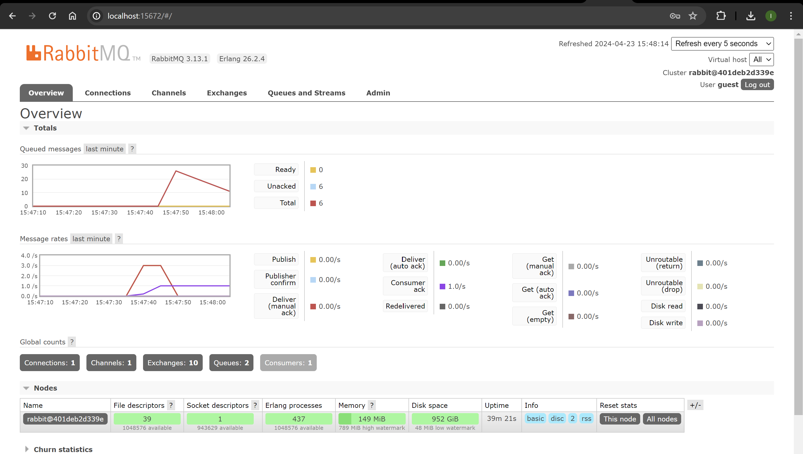

# Tutorial 8 - Subscriber

Nama : Ilham Abdillah Alhamdi
NPM : 2206081194
Kelas : Advance Programming - A

1. Apa itu AMPQ ?
   AMQP singkatan dari Advanced Message Queuing Protocol. Ini adalah protokol lapisan aplikasi standar terbuka untuk middleware berorientasi pesan. Dalam istilah yang lebih sederhana, ini adalah protokol untuk pertukaran pesan antara aplikasi atau komponen.

    AMQP memungkinkan komunikasi antara sistem yang berbeda, memungkinkan mereka untuk bertukar pesan secara andal, asinkron, dan aman. Biasanya digunakan dalam skenario di mana bagian-bagian yang berbeda dari suatu sistem perlu berkomunikasi satu sama lain dengan cara yang terlepas dan dapat diskalakan, seperti dalam sistem terdistribusi, arsitektur mikro layanan, dan sistem pesan perusahaan.

2. Apa arti dari `guest:guest@localhost:5672`? Apa itu `guest` pertama dan apa maksud dari `guest` kedua? Apa arti `localhost:5672`?

    - `guest:guest@localhost:5672` adalah sebuah URI (Uniform Resource Identifier) yang digunakan untuk mengidentifikasi lokasi server yang menjalankan layanan AMQP (Advanced Message Queuing Protocol)
    - `guest:guest` mengacu pada _username_ dan _password_ yang digunakan untuk mengakses server AMQP. Dalam hal ini, "guest" digunakan sebagai _username_ dan _password_ default.
    - `localhost:5672` menunjukkan alamat host dan nomor port server AMQP

3. _Slow Customer Consume Simulation_
    - Terdapat 25 message yang dikirim oleh publisher dalam waktu yang bersamaan
    - Consumer membaca setiap message dalam interval 1 detik
      
